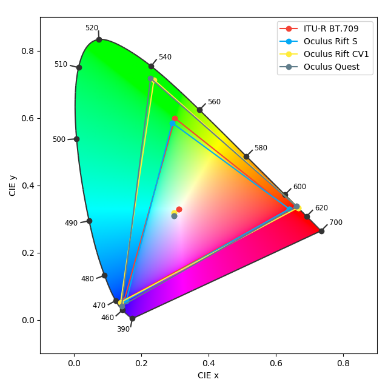

Colorimetry Data for Oculus HMDs
================================

*Published by Matthew Cutone on 14/03/2021*

The version 23.0 release of the Oculus PC SDK exposes a color management API
which has been made accessible through *PsychXR*. The purpose of the API seems
to ensure that content authored to one display appears "correct" on others if
color gamuts vary between them (due to different display technologies in use).
Going forward, this is something that users of *PsychXR* should be aware of and
use, since perceived colors may vary greatly across displays if not accounted
for.

However, the use of this API is not the focus of this article. The new API
documentation provides lots of colorimetry information about various HMDs in the
Oculus product lineup. Such data may be of interest to researchers and users, so
I present them here for reference.

Chromaticity Coordinates
------------------------

Here are the chromaticity coordinates (CIE 1931 xy) of the RGB primaries and
white points of various Oculus HMD devices (from the ``OVR_API.h`` file in the
Oculus PC SDK version 23.0 source code, retrieved 2012-03-14).

============== ================== ================== ================== ==================
HMD Model                Red (xy)         Green (xy)          Blue (xy)   White Point (xy)
============== ================== ================== ================== ==================
Rift CV1       (0.666, 0.334)     (0.238, 0.714)     (0.139, 0.053)     (0.298, 0.318)
Rift S         (0.640, 0.330)     (0.292, 0.586)     (0.156, 0.058)     (0.156, 0.058)
Quest          (0.661, 0.338)     (0.228, 0.718)     (0.142, 0.042)     (0.298, 0.318)
============== ================== ================== ================== ==================

Below is a plot showing the gamuts of the displays. The ITU-R BT.709 colorspace
is also shown for comparison.

Examining the plot, we see that the gamuts for the Rift CV1 and Quest displays
are wider than the one used by the Rift S. This difference seems to have
necessitated the addition of the color management API, as image content authored
to the CV1 and Quest platforms will appear less saturated when presented on the
Rift S unless colors are remapped. The recommendation of the manufacturer is to
create content which looks correct for the device with the widest gamut (Rift
CV1) and enable remapping when using devices with narrower gamuts (Rift S).

